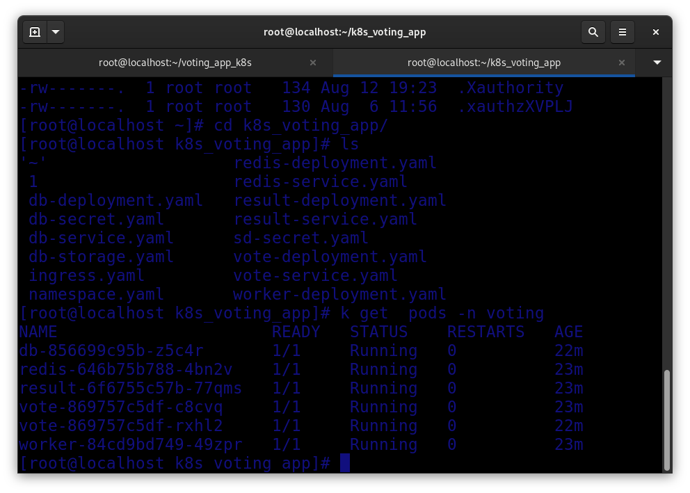
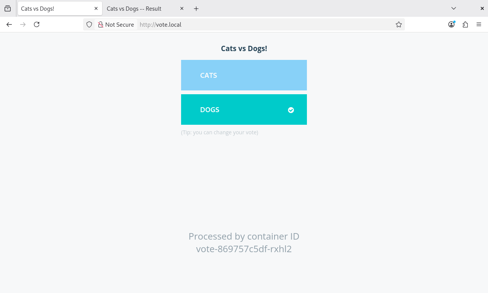
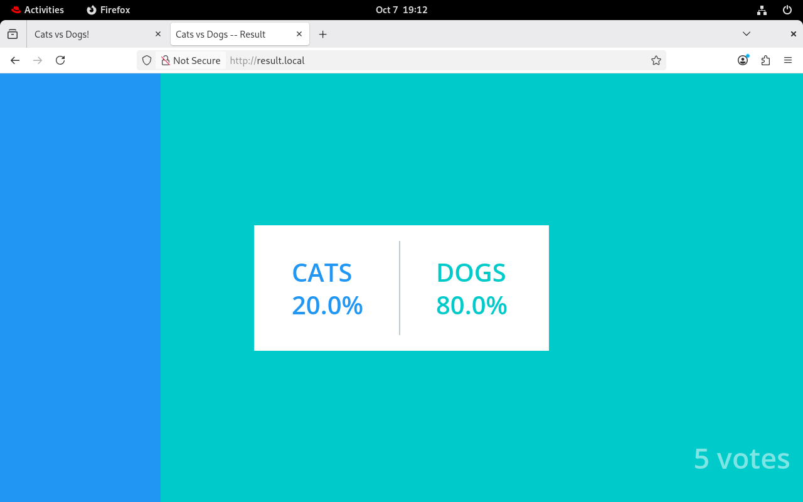

# 🗳️ Voting App on Kubernetes


A multi-service voting application deployed on a **self-managed Kubernetes cluster (kubeadm, single node)**. Users vote between two options on one page, and the results update in real time on another page. Both pages are exposed through a single **NGINX Ingress** using host-based routing.

The application images come from the Docker sample project (`dockersamples/examplevotingapp_*`). **This repository contains only the Kubernetes manifests** and focuses on how to run, expose, secure, and stabilize a multi-tier application on Kubernetes.

---

## 📑 Table of Contents

1. [Architecture](#-architecture)
2. [Repository Structure](#-repository-structure)
3. [Prerequisites](#-prerequisites)
4. [Step-by-Step Deployment](#-step-by-step-deployment)
5. [Final Result](#-final-result)
6. [Reliability: Probes and Resource Limits](#-reliability-probes-and-resource-limits)
7. [Data Persistence Test](#-data-persistence-test)
8. [Troubleshooting Notes](#-troubleshooting-notes-lessons-learned)
9. [Security Notes](#-security-notes)
10. [Future Improvements](#-future-improvements)
11. [Cleanup](#-cleanup)

---

## 🏗️ Architecture

```
                 Browser
                    │
        vote.local / result.local
                    │
        ┌───────────▼───────────┐
        │  NGINX Ingress (:80)  │   ← the only entry point
        └─────┬───────────┬─────┘
              │           │
        ┌─────▼────┐ ┌────▼─────┐
        │   vote   │ │  result  │
        │ (Flask)  │ │(Node.js) │
        │ 2 replicas│ │1 replica │
        └─────┬────┘ └────▲─────┘
              │           │
        ┌─────▼────┐  ┌───┴──────────┐
        │  redis   │  │  PostgreSQL  │
        │ (queue)  │  │  + PV / PVC  │
        └─────▲────┘  └───▲──────────┘
              │           │
              └── worker ─┘
                (.NET)
```

### How a vote travels

1. The user opens **vote.local** and picks an option.
2. The **vote** app pushes the vote into **Redis**, which acts as a fast in-memory queue.
3. The **worker** pops votes from Redis and writes them into **PostgreSQL**.
4. The **result** app reads PostgreSQL and shows live percentages on **result.local**.

### Components

| Component | Technology | Role | Exposure |
|-----------|-----------|------|----------|
| `vote` | Python / Flask | Voting page (2 replicas) | Ingress → `vote.local` |
| `redis` | Redis 7 | Temporary vote queue | ClusterIP (internal only) |
| `worker` | .NET | Moves votes from Redis to PostgreSQL | None (no incoming traffic) |
| `db` | PostgreSQL 15 | Persistent results storage | ClusterIP (internal only) |
| `result` | Node.js | Live results page | Ingress → `result.local` |

> Services find each other by **Kubernetes DNS names**. The sample images expect the hostnames `redis` and `db`, which is why the Service names are chosen exactly like that.

---

## 📂 Repository Structure

```
.
├── README.md
├── images/                    # Screenshots used in this README
└── k8s/
    ├── namespace.yaml         # Isolated namespace: voting
    ├── redis-deployment.yaml
    ├── redis-service.yaml
    ├── db-secret.yaml         # PostgreSQL credentials
    ├── db-storage.yaml        # PersistentVolume + PersistentVolumeClaim
    ├── db-deployment.yaml
    ├── db-service.yaml
    ├── worker-deployment.yaml
    ├── vote-deployment.yaml
    ├── vote-service.yaml
    ├── result-deployment.yaml
    ├── result-service.yaml
    └── ingress.yaml           # Host-based routing
```

---

## ✅ Prerequisites

- A running Kubernetes cluster (this project was built on **kubeadm** with **Flannel**) and `kubectl`
- **NGINX Ingress Controller** installed (bare-metal manifest):

  ```bash
  kubectl apply -f https://raw.githubusercontent.com/kubernetes/ingress-nginx/controller-v1.15.1/deploy/static/provider/baremetal/deploy.yaml
  ```

  On a single-node bare-metal cluster, let the controller listen directly on port 80 using the host network:

  ```bash
  kubectl patch deployment ingress-nginx-controller -n ingress-nginx --type=json -p='[
    {"op":"add","path":"/spec/template/spec/hostNetwork","value":true},
    {"op":"add","path":"/spec/template/spec/dnsPolicy","value":"ClusterFirstWithHostNet"}
  ]'
  ```

  > Port 80 on the node must be free (for example, stop Apache with `systemctl disable --now httpd`).

- **Recommended resources:** 2+ CPUs and 4 GB+ RAM. See [Troubleshooting](#-troubleshooting-notes-lessons-learned) for why this matters.

---

## 🚀 Step-by-Step Deployment

Clone the repository:

```bash
git clone https://github.com/shahdahmed123/voting_app_k8s.git
cd voting_app_k8s
```

### 1. Namespace

```bash
kubectl apply -f k8s/namespace.yaml
```

A **Namespace** is like a folder inside the cluster. It keeps all project resources organized and isolated from everything else. It must be created first, because every other manifest lives inside it.

### 2. Redis (the vote queue)

```bash
kubectl apply -f k8s/redis-deployment.yaml -f k8s/redis-service.yaml
```

- The **Deployment** runs one Redis Pod and restarts it automatically if it fails.
- The **Service** (`ClusterIP`) gives Redis a stable internal name, `redis`, because Pod IPs change every time a Pod is recreated. Being `ClusterIP` means nobody outside the cluster can reach it.

### 3. PostgreSQL (persistent storage)

```bash
kubectl apply -f k8s/db-secret.yaml -f k8s/db-storage.yaml
kubectl apply -f k8s/db-deployment.yaml -f k8s/db-service.yaml
```

| Resource | Purpose |
|----------|---------|
| **Secret** (`db-secret`) | Stores the database user and password instead of hard-coding them in the Deployment. |
| **PersistentVolume** (`db-pv`) | The actual storage: a `hostPath` folder on the node (`/mnt/data/postgres`). |
| **PersistentVolumeClaim** (`db-pvc`) | The Pod's request for storage. Kubernetes binds it to the matching PV. |
| **Deployment** | Runs PostgreSQL with the volume mounted. Uses the `Recreate` strategy so two Pods never write to the same data folder at once. |
| **Service** (`db`) | Internal name `db`, which the worker and result apps connect to. |

Verify that the storage is bound:

```bash
kubectl get pv,pvc -n voting
```


> `STATUS: Bound` on both the PV and the PVC means the database has persistent storage.

### 4. Worker

```bash
kubectl apply -f k8s/worker-deployment.yaml
kubectl logs deploy/worker -n voting
```

The worker consumes votes from Redis and writes them to PostgreSQL. It **has no Service** because it only makes outgoing connections and nobody connects to it. It also creates the `votes` table automatically on first run.


> The logs confirm the worker connected to both the database and Redis, which also proves Kubernetes DNS resolution works.

### 5. Vote and Result apps

```bash
kubectl apply -f k8s/vote-deployment.yaml -f k8s/vote-service.yaml
kubectl apply -f k8s/result-deployment.yaml -f k8s/result-service.yaml
```

- **vote** runs with **2 replicas**. It is stateless (votes go straight to Redis), so the Service can load-balance between the Pods and survive the loss of one.
- **result** runs with 1 replica and reads from PostgreSQL.
- Both Services are `ClusterIP`: they are only reachable through the Ingress.

### 6. Ingress (single entry point)

```bash
kubectl apply -f k8s/ingress.yaml
kubectl get ingress -n voting
```

The Ingress routes traffic based on the requested host name:

| Host | Backend Service |
|------|-----------------|
| `vote.local` | `vote:80` |
| `result.local` | `result:80` |


Add the node IP to your `hosts` file so the names resolve:

```
<NODE-IP>  vote.local  result.local
```

- **Linux / macOS:** `/etc/hosts`
- **Windows:** `C:\Windows\System32\drivers\etc\hosts` (edit as Administrator)

### Everything together

```bash
kubectl get all -n voting
```



> All Pods are `1/1 Running` with zero restarts, and all Services are `ClusterIP`.

---

## 🎉 Final Result

### Voting page: `http://vote.local`



### Results page: `http://result.local`



---

## 🛡️ Reliability: Probes and Resource Limits

### Health probes

| Component | Startup | Readiness | Liveness |
|-----------|---------|-----------|----------|
| vote, result | HTTP `GET /` | HTTP `GET /` | HTTP `GET /` |
| db | none | `pg_isready` | `pg_isready` |
| redis | none | `redis-cli ping` | `redis-cli ping` |
| worker | none | none | none (no port to check; Kubernetes restarts it if it exits) |

- **Startup probe:** gives a slow application time to boot before the other probes begin.
- **Readiness probe:** removes a Pod from the Service while it is not ready to receive traffic.
- **Liveness probe:** restarts a Pod that is stuck.

### Resource requests and limits

| Component | CPU request / limit | Memory request / limit |
|-----------|--------------------|------------------------|
| vote, result | 50m / 500m | 64Mi / 256Mi |
| worker | 50m / 300m | 64Mi / 256Mi |
| db | 100m / 500m | 128Mi / 512Mi |
| redis | 50m / 200m | 64Mi / 128Mi |

- **Requests** are what the scheduler reserves for the Pod.
- **Limits** are the ceiling. Exceeding the CPU limit throttles the Pod; exceeding the memory limit gets it killed (`OOMKilled`).

Inspect the configuration of a running Pod:

```bash
kubectl describe pod -l app=vote -n voting | grep -E "Liveness|Readiness|Startup|Limits|Requests" -A2
```


---

## 💾 Data Persistence Test

To prove that votes survive a database Pod restart, delete the PostgreSQL Pod and watch Kubernetes recreate it:

```bash
kubectl delete pod -l app=db -n voting
kubectl get pods -n voting
```


After the new Pod is `Running`, refresh `http://result.local`: **the previous votes are still there**, because the data lives on the PersistentVolume, not inside the Pod.

---

## 🔧 Troubleshooting Notes (Lessons Learned)

Real problems hit while building this project:

| Problem | Cause | Fix |
|---------|-------|-----|
| Probes failing with `context deadline exceeded`, Pods stuck in `CrashLoopBackOff` | Default probe timeout is **1 second**, and apps were slow to start on a loaded machine | Added `startupProbe`, raised `timeoutSeconds` to 5, raised the CPU limit |
| Pods restarting constantly, load average far above CPU count | The node had **~250 MB free RAM** and no swap. Unrelated containers were consuming memory | Stopped the unrelated containers. Use at least 4 GB RAM |
| Ingress controller could not start | Another service (Apache `httpd`) was already listening on port 80 | Stopped and disabled `httpd` |
| `kubectl apply -f k8s/` fails on first run | Files apply in alphabetical order, so resources are applied before the namespace exists | Apply `namespace.yaml` first |
| PVC stuck in `Pending` | The cluster has no default StorageClass | Created a manual PV with `storageClassName: manual` |

Useful debugging commands:

```bash
kubectl describe pod <pod> -n voting        # events and probe failures
kubectl logs <pod> -n voting --previous     # logs of the crashed container
kubectl get events -n voting --sort-by=.lastTimestamp
```

---

## 🔐 Security Notes

- `db-secret.yaml` contains **demo credentials** (`postgres` / `postgres`) because the sample images expect them. Kubernetes Secrets are only base64-encoded, not encrypted. **Never commit real secrets to Git.**
- Only the Ingress is exposed externally. Redis, PostgreSQL, vote, and result are `ClusterIP`.
- With plain **Flannel**, `NetworkPolicy` objects are accepted but **not enforced**. A CNI such as Calico or Cilium is required.
- `hostPath` volumes are suitable for a single-node lab only, not for production.

---

## 🔮 Future Improvements

- [ ] Add `NetworkPolicy` rules (for example, only the worker and result app may reach PostgreSQL) using Calico
- [ ] Add HTTPS/TLS to the Ingress with cert-manager
- [ ] Replace the `hostPath` PV with a dynamic StorageClass
- [ ] Package the manifests as a **Helm chart** or use **Kustomize** for environments
- [ ] Add a HorizontalPodAutoscaler (requires metrics-server)
- [ ] Add CI/CD (GitHub Actions) for manifest validation
- [ ] Evaluate a currently maintained ingress option, such as the Gateway API

---

## 🧹 Cleanup

```bash
kubectl delete -f k8s/
kubectl delete pv db-pv        # the PV is not removed with the namespace (reclaim policy: Retain)
```

---

## 👩‍💻 Author

**Shahd Ahmed**
[GitHub](https://github.com/shahdahmed123)

